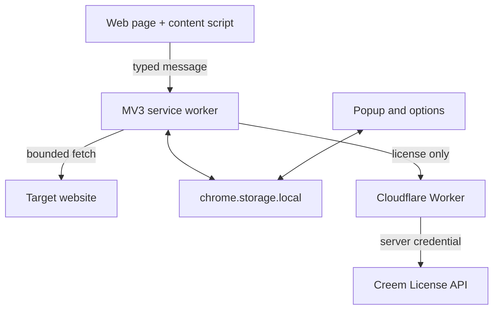

# Architecture

## System shape

The extension is the product. The Worker is only a secret-holding license adapter.

## Module ownership

| Module | Responsibility | Must not do |
| --- | --- | --- |
| content script | link intent, anchored UI, user actions, Peek Stack | hold secrets or call Creem |
| service worker | remote fetch, cache coordination, tabs, commands, licensing | render page UI |
| core | pure validation, parsing, cache, history, receipts, imports | depend on Chrome UI state |
| platform storage | schema migration and serialized updates | make product decisions |
| popup/options | status, settings, history, backup, activation | grant Pro without verified receipt |
| Cloudflare Worker | validate input, call Creem, normalize errors, sign receipt | store browsing data or expose API keys |

## Preview flow

1. The content script observes one delegated pointer/focus stream.
2. The chosen modifier plus intent delay creates a request ID.
3. The service worker validates/normalizes the URL and checks the persistent LRU cache.
4. Concurrent requests for the same normalized URL share one fetch.
5. The response is bounded by scheme, redirects, time, content type, and bytes.
6. Metadata and readable plain text become a typed `PreviewRecord`.
7. The content script inserts values using `textContent` inside Shadow DOM.
8. Pro history is recorded locally only after a successful result.

## License flow

1. The user enters a Creem license key in the options page.
2. The background service worker sends it over HTTPS to the configured Worker.
3. The Worker calls Creem's activate/validate/deactivate endpoint with the server-only API key.
4. The Worker rejects a wrong product, mode, status, instance, or expiration.
5. The Worker signs a 72-hour entitlement receipt with ECDSA P-256.
6. The extension verifies signature and claims with the bundled public JWK before storing Pro status.
7. Provider rejection invalidates immediately; only network/provider outage can enter the four-day grace window.

## Persistence

One versioned `peek` object in `chrome.storage.local` contains settings, license state, pins, Pro history, and preview cache. Updates are serialized in-process to prevent overlapping read-modify-write loss. Cache is expendable; pins and history are user data.

No database is required. Adding one would increase privacy risk and operational cost without helping the v0.1 promise.
